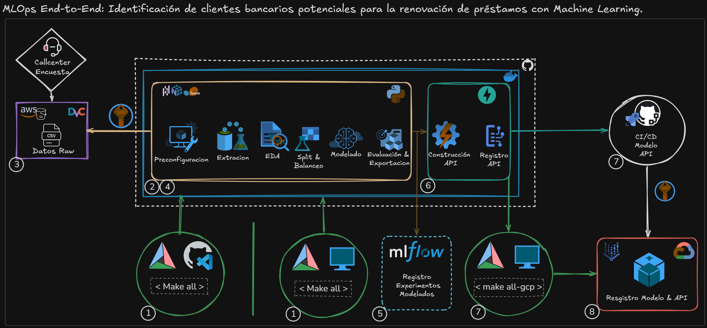
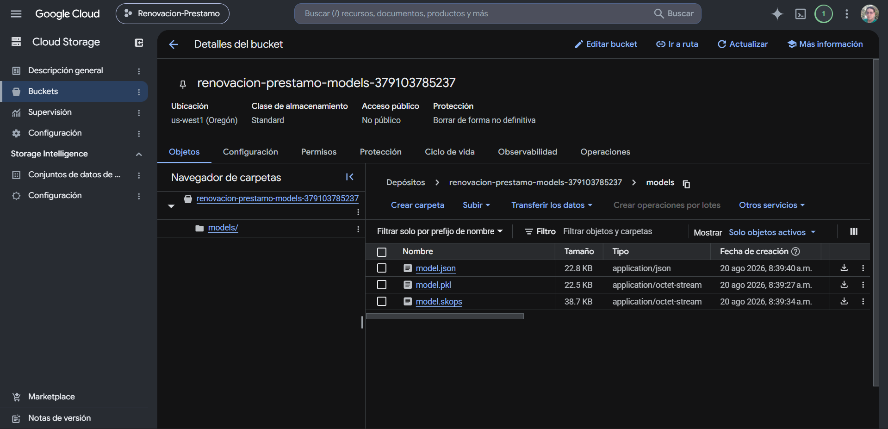
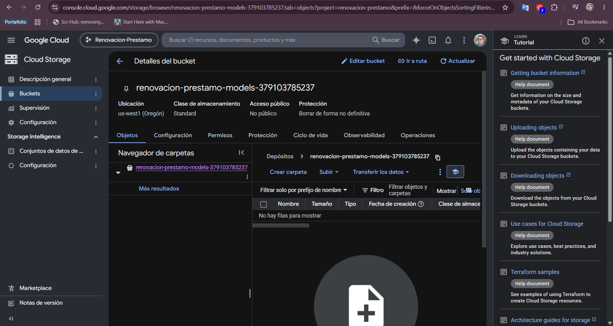
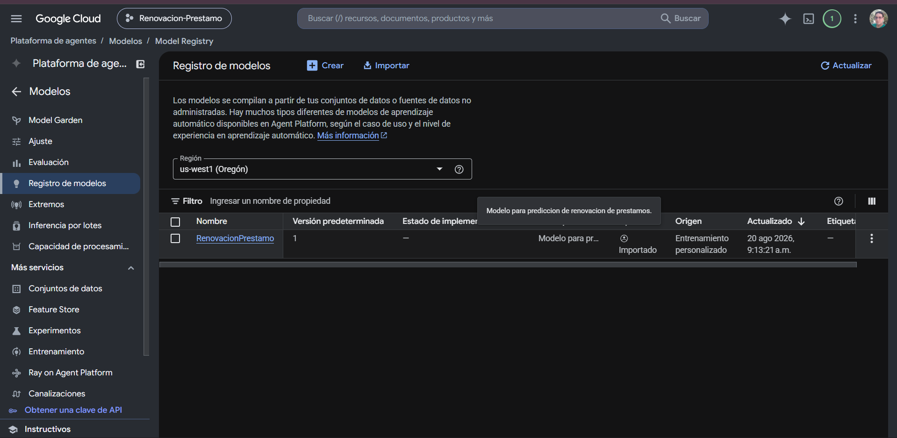
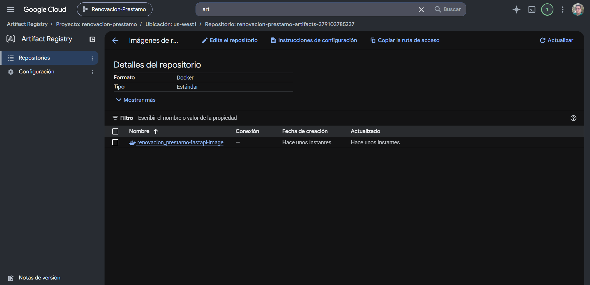
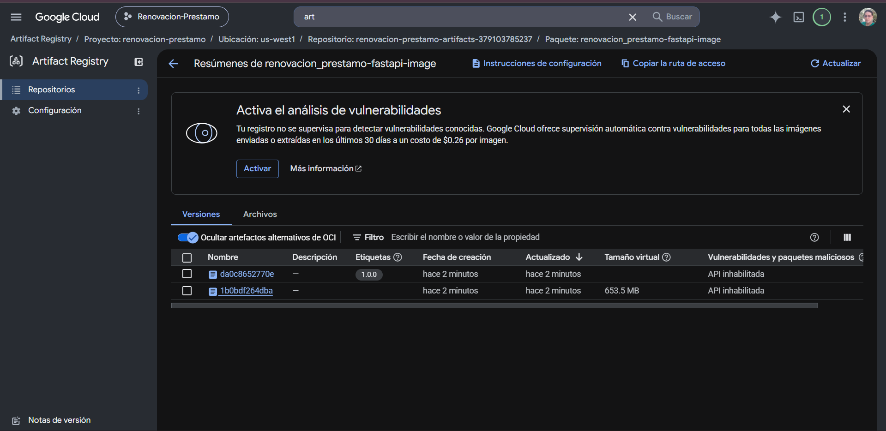

# ✨ Proyecto MLOPS End-To-End con Dataset de Renovacion Prestamo Bancario
Proyecto integral de **MLOPs End-To-End** diseñado para predecir la propensión de renovación de préstamos bancarios con un dataset Desbalanceado. Se analizan datos guardados en **AWS S3 Bucket** con **Data Version Control (DVC)** desde contenedores **dockers multistage** que transforma los datos, compara diversos modelos de aprendizaje automatico supervisado y selecciona el  modelo con mejor recall y realiza fine tunning guardando todos los entrenamientos con **MLFLOW**. Por ultimó, se exporta el modelo en .pkl, .skops y .json y se crea una aplicacion para prediccion con el framework **FastAPI** al cumplir con las validaciones de pruebas unitarias con **Pytest** y se exportan los modelos y la API a **Google Cloud Storage**, **Vertex AI** y **Artifact Registry** mediante autenticación segura sin exposición de secretos (ADC).

> **Resultado Clave de Machine Learning:** Tras evaluar múltiples modelos supervisados, **XGBoost Classifier** optimizado alcanzó un **Recall superior al 65%** en la clase minoritaria (debido a la naturaleza desbalanceada del dataset), priorizando la reducción de falsos negativos para maximizar la retención de clientes en campañas crediticias.

## 🎯 Resumen del Proyecto
- **Gestion de Datos y Versionado (AWS S3 & DVC):** Dataset real derivado del proyecto de Machine Learning: **[renovacion_prestamo_ML](https://github.com/SanehetSiordia/renovacion_prestamo_ML)** almacenados en AWS S3 Bucket con gestor de DVC para control de versiones y gestionado a traves de un contenedor docker con awscli "dvc[s3]" instalado y accesibilidad a travéz del ACCESS_KEY.
- **Extraccion y Transformacion de los Datos:** Extraccion y transformacion automatizados desde un contenedor docker.
- **Entrenamiento, Registro y Exportacion de Modelos ML:** Entrenamiento y exportacion de modelos de aprendizaje supervisado con fine tunning y registros de experimentos versionados con MLFLOW desde contenedores docker.
- **Aplicacion API REST para prediccion de Modelo Resultante:** Creacion de Api Rest con Framework FastAPI con Uvicorn para pruebas de prediccion locales al cumplir con pruebas unitarias hechas con Pytest desde un contenedor docker. 
- **Publicacion de Modelos en Google Cloud Platform:** Exportacion de modelos .pkl, .skops y .json a la plataforma Google Cloud Storage con registro del modelo en Vertex AI e integracion de la imagen docker del API de prediccion a Google Cloud Artifact Registry a traves de un contenedor docker con Google cloud-SDK instalado y seguridad Application Default Credentials (ADC) por sesión montada en modo solo lectura (:ro), sin claves fijas en el repositorio.

---

## 🛠️ Stack Tecnológico

[](#)
[](#)
[](#)
[](#)
[](#)
[](#)
[](#)
[](#)

---
## 🏛️ Arquitectura del Sistema


---

## ⚙️ Requisitos Previos

- Cuenta GitHub
- Docker
- Make
- Cuenta AWS
- Cuenta Google Cloud
- Google Cloud CLI

### Instalación del entorno
**_Por temas de seguridad no se deben compartir las llaves de acceso a los repositorios cloud_**

Descargar los datos .csv del repositorio 
[renovacion_prestamo_ML](https://github.com/SanehetSiordia/renovacion_prestamo_ML/tree/main/data)

Agregar el archivo descargado a su storage AWS S3 Bucket de la forma: 
**[Documentacion Oficial](https://docs.aws.amazon.com/AmazonS3/latest/userguide/GetStartedWithS3.html)
**

Crear archivo .env con base al archivo **_.env.example_** y llenar los datos con las credenciales correspondientes.

Descargar Docker Desktop de la ruta oficial **[Docker Desktop on Windows](https://docs.docker.com/desktop/setup/install/windows-install/)**

```bash

# Instalar la herramienta Make para la gestion de CI/CD en maquina local con el comando en CMD:
winget install ezwinports.make
# Comprobar Make instalado con el comando en CMD:
make --version
# Instalar Docker con el comando en CMD:
# Clonar el repositorio GitHub con el comando en CMD:
git clone https://github.com/SanehetSiordia/renovacion_prestamo_mlops.git
#Ingresar al repositorio con el comando en CMD:
cd renovacion_prestamo_mlops
# Ejecutar comando Make en CMD:
Make all
# Validar entornos virtuales desde Browser:
http://localhost:8085/          --FastApi Home
http://localhost:8085/docs      --FastApi OpenApi
http://localhost:8085/health    --FastApi Healthchek
http://localhost:5000/          --MLFLOW GUI

# En caso de tener cuenta Google Cloud debe tener instalado Google Cloud CLI
# Para instalarlo en Windows debe ejecutar el siguiente comando en Powershell:
(New-Object Net.WebClient).DownloadFile("https://dl.google.com/dl/cloudsdk/channels/rapid/GoogleCloudSDKInstaller.exe", "$env:Temp\GoogleCloudSDKInstaller.exe") & $env:Temp\GoogleCloudSDKInstaller.exe

# Debe iniciar el programa con el comando en CMD:
gcloud init
# Para generar las credenciales ADC debe ejecutar el comando en CMD:
gcloud auth application-default login
# Por ultimo debe ejecutar el comando del makefile en CMD:
make all-gcp

# Detener todo los contenedores, purgar volumenes y cache con el comando en CMD:
make down
# Para mayor informacion ejecutar comando make en el CMD:
make help

```
En caso de tener cuenta Google Cloud y querer registrar el modelo y API se debe visualizar de la siguiente forma el proyecto:
**_Registro del modelo .pkl , .skops y .json en GCP storage_**:


**_Registro del modelo en Vertex AI_**:

**_Registro del API en Artifact Registry_**:



---

## 📂 Estructura del Repositorio
```text
.
├── .dvc/
│   └── config                      # Archivo de configuracion de ruta de los archivos fuentes con dvc
├── .github/workflows/
│   └── pipeline.yml                # Pipeline de CI/CD End-To-End (GitHub Actions) Rama Feature To Main
├── api/
│   ├── __init__.py                 
│   ├── app.py                      # Clase con las rutas principales http del fastapi
│   ├── predictor.py                # Clase con el cargado del modelo y pruebas de validacion
│   └── schemas.py                  # Clase con el esquema de las caracteristicas del modelo
├── artifacts/                      # Ruta donde se guardan los modelos generados con el entrenamiento local (.json,.pkl,.skops)
│   └── metrics.json                # Metricas resultantes del ultimo entrenamiento local del mejor modelo
├── data/                           # Ruta donde se descargan de S3 bucket los archivos .csv con "make download-aws"
│   ├── processed/processed_renovacion_prestamo.csv.dvc
│   └── raw/raw_renovacion_prestamo.csv.dvc
├── evidencias/
│   └── *.png                       # Evidencias de resultados en AWS S3 Bucket y GCP Bucket, Vertex-Ai y artifact-registry
├── mlruns/                         # Rutal que guarda los modelados con MLFLOW de forma local y automatica
├── notebooks/                      # Análisis exploratorio y prototipado experimental
│   └── notebook_renovacion_prestamo.ipynb
├── requirements/
│   ├── fastapi.txt                 # Librerias requeridas para la fase de FastAPI del proyecto
│   └── training.txt                # Librerias requeridas para la fase del entrenamiento del modelo
├── src/                            # Pipeline modular de Data Science y MLOps
│   ├── __init__.py                 
│   ├── manage_data.py              # Clase para limpieza y transformacion de los datos
│   ├── train_model.py              # Clase para entrenar los modelos y generar los artefactos finales
│   ├── manage_versions.py          # Clase para gestionar el versionamiento de los modelados con MLFLOW
│   └── validate_model.py           # Clase para validar y guardar las metricas del modelo final
└── tests/
│   ├── __init__.py                 
│   ├── test_data.py                # Clase para validar el formato del dataset procesado
│   ├── test_model.py               # Clase para validar los metodos de entrenamiento del modelo
|   └── test_pipeline.py            # Clase para validar las metricas finales del modelo para aprobar el CI/CD
├── compose.yml             # Orquestación de servicios Multi-Stage
├── Dockerfile              # Construcción Multi-Stage modular
└── Makefile                # Automatización de tareas y comandos CLI
```


---

## Plan a Futuro
- Agregar desacoplamiento de transformacion de datos con PySpark y Databricks para FullStack MLOPs Project
- Data Pipeline Distribuido: Integrar clúster de Databricks Community Edition (PySpark) para feature engineering a gran escala conectado directamente con AWS S3.
- Monitoreo Continuo: Implementar Evidently AI para detección de Data Drift y Concept Drift en producción.